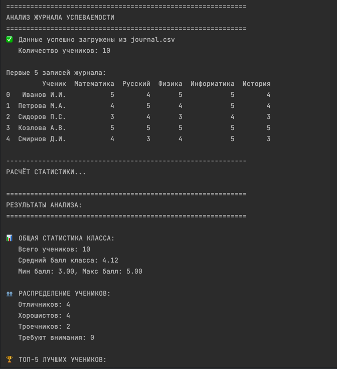
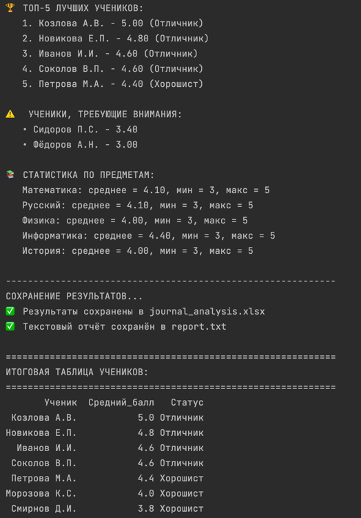
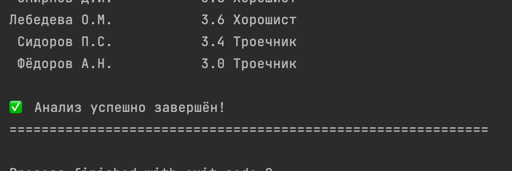

# выполнила Костылева Э.П. ИВТ 4 курс 1гр 1пгр
## Модуль 2 задание 1
### Файл `journal.csv` содержит данные успеваемости 10 учеников по 5 предметам:
```csv
Ученик,Математика,Русский,Физика,Информатика,История
Иванов И.И.,5,4,5,5,4
Петрова М.А.,4,5,4,5,4
Сидоров П.С.,3,4,3,4,3
Козлова А.В.,5,5,5,5,5
Смирнов Д.И.,4,3,4,5,3
Новикова Е.П.,5,5,4,5,5
Фёдоров А.Н.,3,3,3,3,3
Морозова К.С.,4,4,4,4,4
Соколов В.П.,5,4,5,4,5
Лебедева О.М.,3,4,3,4,4 
```

### Алгоритм работы
* Загрузка данных из CSV файла
* Расчет среднего балла для каждого ученика
* Определение статуса ученика
* Расчет статистики по классу и предметам
* Выявление отличников и отстающих 
* Сохранение результатов в файлы


Результаты:


