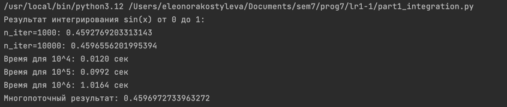

# Лабораторная работа 1
## выполнила Костылева Э.П. ИВТ 4 курс
1.1. Реализация последовательного интегрирования

```python
def integrate(f, a, b, *, n_iter=1000):
    dx = (b - a) / n_iter
    total = 0.0
    for i in range(n_iter):
        x = a + i * dx
        total += f(x) * dx
    return total
```
Принцип работы: Метод прямоугольников для численного интегрирования.

1.2. Тестирование производительности
Методика: Использование модуля timeit для оценки времени выполнения при различных n_iter.


Часть 2. Многопоточное тестирование
