Практическая работа - RESTful веб-приложение на Spring
Boot

1. Запуск
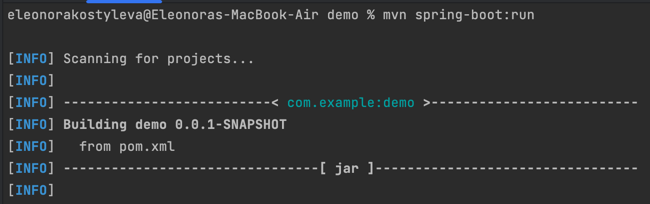
...
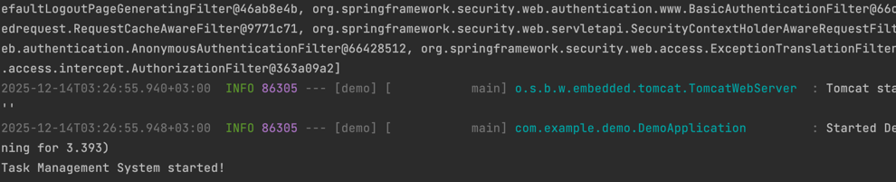
2. Страница с авторизацией
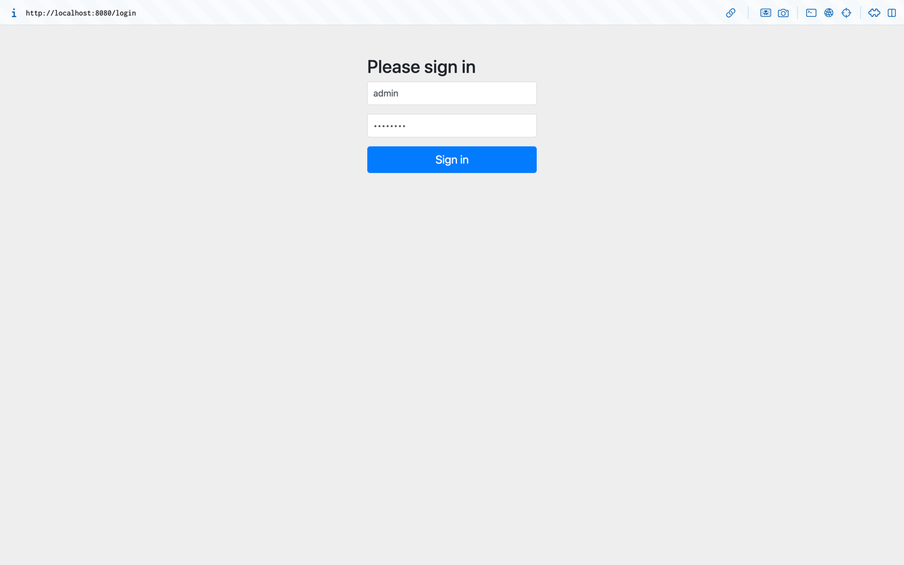
3. Подключение к БД через локальный хост
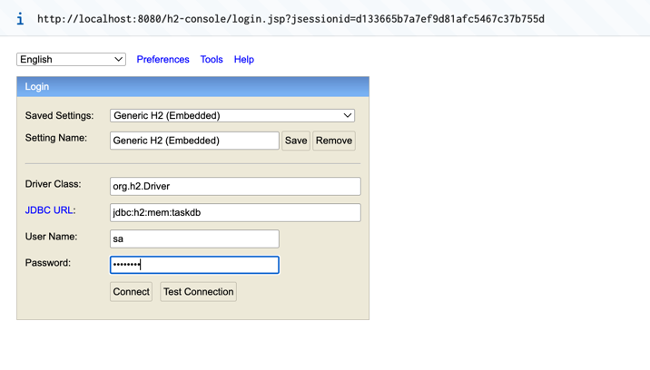
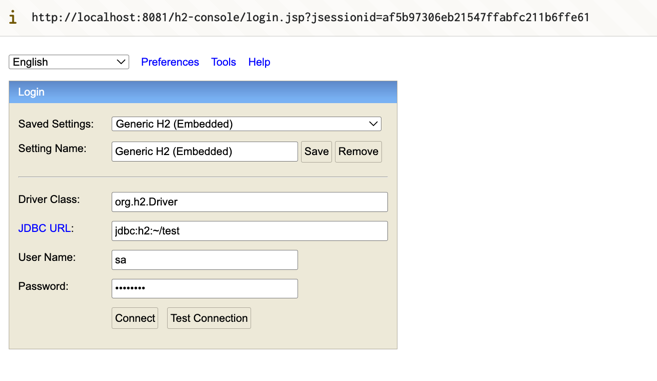

4. Использования Postman для тестирования CRUD операций:
POST:Создание новой задачи
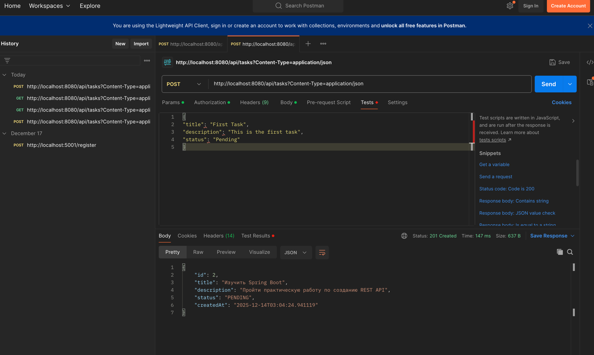
GET: Получение списка задач (после добавления первой задачи):
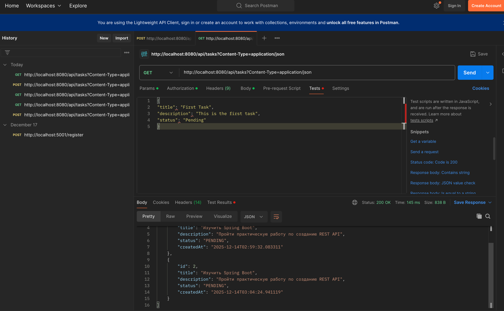
POST:  Создание еще одной задачи:
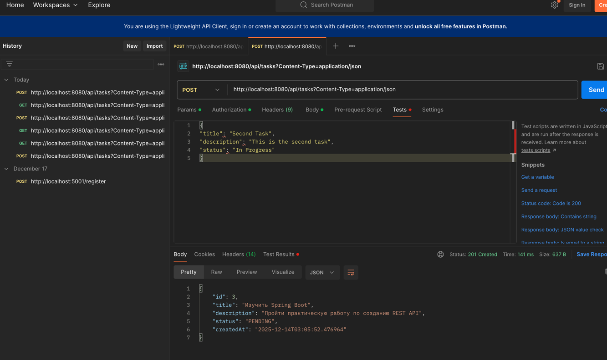
PUT: Обновление существующей задачи:
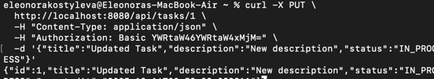
DELETE: Удаление задачи:
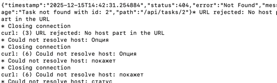
Проверка списка задач после удаления:
– Отправьте запрос GET /api/tasks.
– Ожидаемый результат: в ответе содержится толькçо первая задача, поскольку вторая была удалена. 
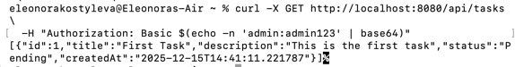
Получение несуществующей задачи:
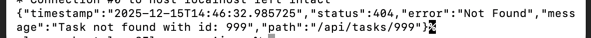