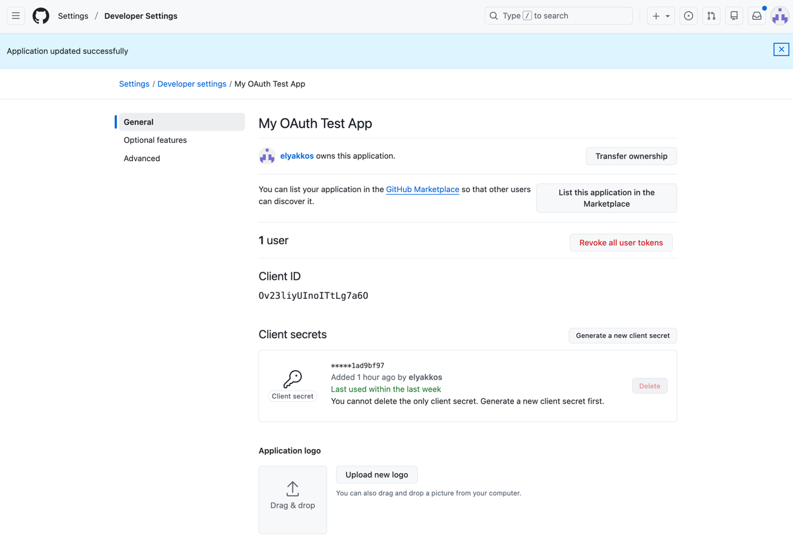
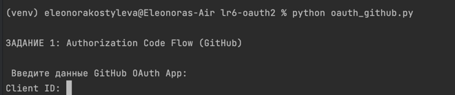
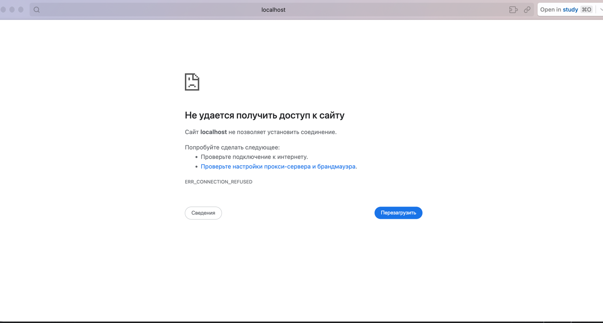
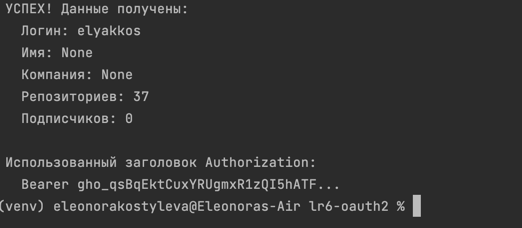
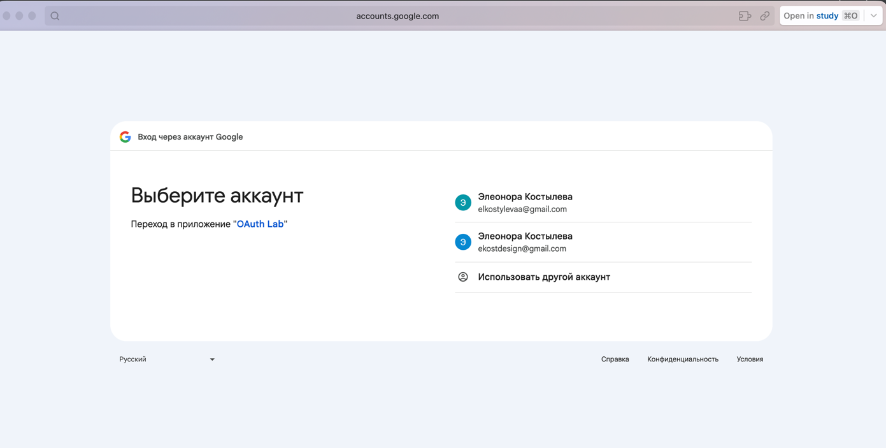
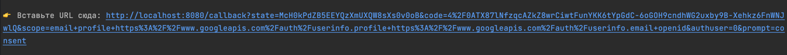
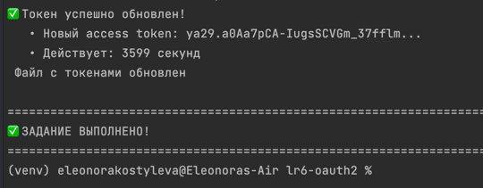

OAUTH 2.0 - Костылева Э.П. ИВТ 4 курс

Быстрый старт
# 1. Установка
python -m venv venv
source venv/bin/activate      # Linux/Mac
venv\Scripts\activate        # Windows
pip install requests

# 2. Регистрация OAuth-приложения
#    Перейти: https://github.com/settings/applications/new
#    Callback URL: http://localhost:8000/callback

# 3. Запуск
python 1_github_oauth.py

Отчет:

Создание application on GitHub

Задание 1. Реализация Authorization Code Flow

запускаем oauth_github.py

После ввода требуемых значений открывается страница, чей URL надо скопировать и вставить в терминале

Итог: 

Задание 2. Обновление токена (refresh token)

Запускаем oauth_google_refresh.py
Открывается страница для авторизации

После авторизации копируем ссылку как в 1 задании и вставляем в терминал

Итог:

