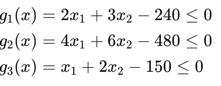
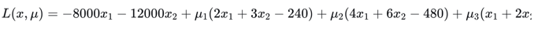
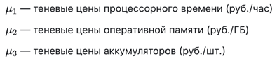
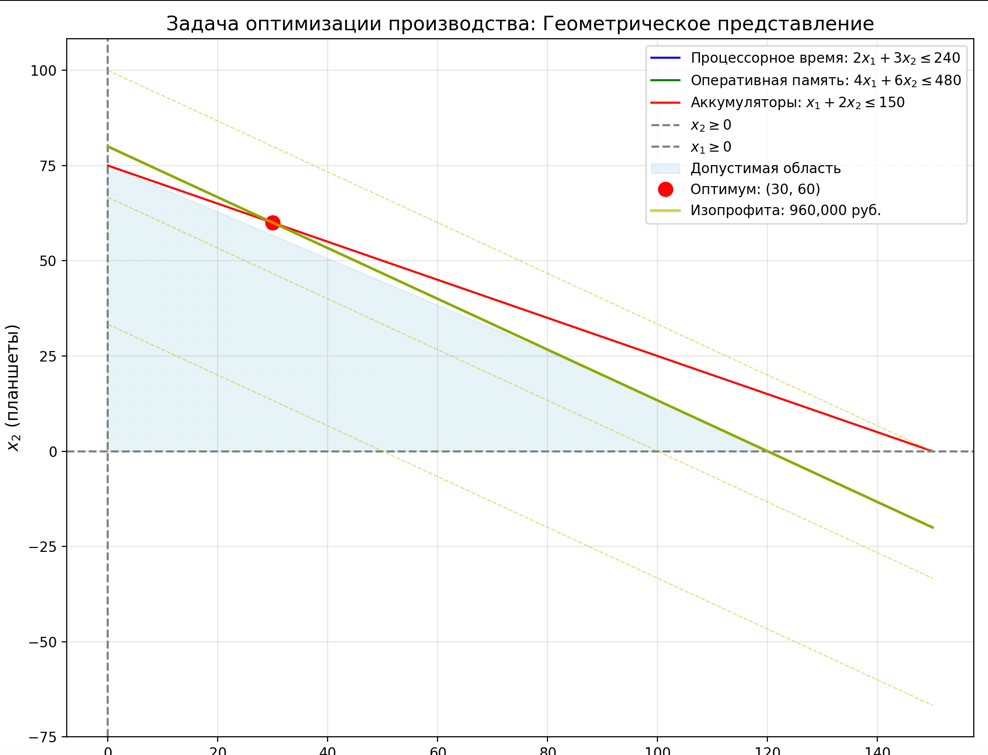
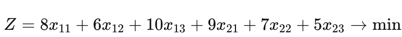
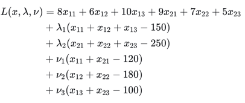
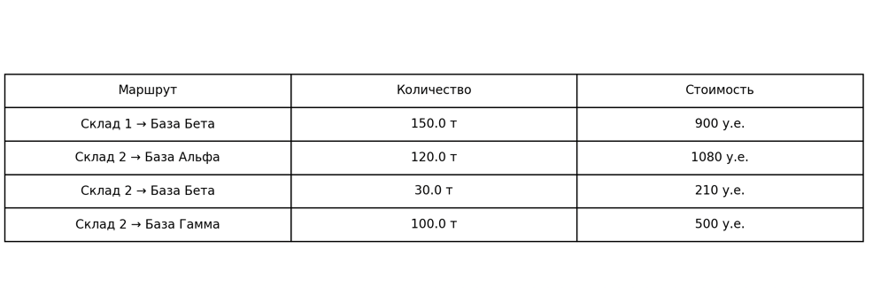

Костылева Элеонора Павловна,  группа 1.1, 04.01.2026
# Теоретическая часть:
## Основные понятия ЛП
•	Целевая функция: Линейная функция для максимизации/минимизации
•	Ограничения: Линейные равенства/неравенства
•	Условия: xj≥0xj≥0
### 2. Классические методы решения
2.1. Симплекс-метод 
•	Принцип: Перебор вершин многогранника
•	Плюсы: Прост в реализации, хорош для малых задач
•	Минусы: Экспоненциальная сложность в худшем случае
2.2. Методы внутренней точки 
•	Принцип: Движение через внутренность области
•	Плюсы: Полиномиальная сложность, эффективен для больших задач
•	Минусы: Сложная реализация
3. Решение в Python 
python
from scipy.optimize import linprog
result = linprog(c, A_ub=A_ub, b_ub=b_ub, 
                 A_eq=A_eq, b_eq=b_eq,
                 bounds=bounds, method='highs')
## Методы: 'highs' (по умолчанию), 'simplex', 'interior-point'
4. Условия оптимальности (KKT)
1.	Стационарность: ∇L=0∇L=0
2.	Допустимость: Удовлетворение ограничениям
3.	Двойственная допустимость: μi≥0μi≥0
5. Экономический смысл
•	Множители Лагранжа = теневые цены ресурсов
•	Показывают ценность дополнительной единицы ресурса
6. Особые случаи
•	Транспортная задача: Частный случай ЛП
•	Сбалансированность: ∑∑ запасы = ∑∑ потребности
•	Анализ чувствительности: Как меняется решение при изменении параметров
7. Практическое применение
•	Производство: Оптимизация выпуска продукции
•	Транспорт: Минимизация логистических затрат
•	Финансы: Оптимизация инвестиций
•	Военное дело: Планирование снабжения

# Решение Задачи 1:

1. Мат.модель
Переменные: х1, х2  - количество смартфонов, количество планшетов
Целевая функция: Р(х1,х2) = 8000х1 + 12000х2 -> max
Ограничения: 
- Процессорное время: 2х1 + 3х2 <= 240
- Оперативная память 4х1 + 6х2  <= 480
- Аккумуляторы: х1 + 2х2 <= 150
- Неотрицательность: х1 >= 0, x2 >=0
2. Функция Лагранжа
- Каноническая форма для минимизации
f(x) = -8000x1 - 12000x2x -> min
- Ограничения в форме gi(x) 

- Функция Лагранжа 

- Экономический смысл множителей Лагранжа:

  3. Код
```Python
from scipy.optimize import linprog
import numpy as np
import matplotlib.pyplot as plt

# Целевая функция (для максимизации умножаем на -1)
c = [-8000, -12000]

# Ограничения-неравенства
A_ub = [[2, 3], [4, 6], [1, 2]]
b_ub = [240, 480, 150]

# Границы переменных
bounds = [(0, None), (0, None)]

# Решение задачи
result = linprog(c, A_ub=A_ub, b_ub=b_ub, bounds=bounds, method='highs')

# Вывод результатов
print("=== РЕЗУЛЬТАТЫ ЗАДАЧИ 1 ===")
print(f"Смартфонов: {result.x[0]:.0f} шт.")
print(f"Планшетов: {result.x[1]:.0f} шт.")
print(f"Максимальная прибыль: {-result.fun:,.0f} руб.")
```
4. Графики 
```python
# Визуализация
fig, ax = plt.subplots(figsize=(10, 6))

# Область построения
x1 = np.linspace(0, 120, 100)

# Границы ограничений
x2_time = (240 - 2*x1) / 3
x2_memory = (480 - 4*x1) / 6
x2_battery = (150 - x1) / 2

# Рисуем ограничения
ax.plot(x1, x2_time, 'b-', label='2x₁ + 3x₂ ≤ 240')
ax.plot(x1, x2_memory, 'g-', label='4x₁ + 6x₂ ≤ 480')
ax.plot(x1, x2_battery, 'r-', label='x₁ + 2x₂ ≤ 150')

# Оптимальная точка
ax.plot(result.x[0], result.x[1], 'ro', markersize=10, 
        label=f'Оптимум ({result.x[0]:.0f}, {result.x[1]:.0f})')

# Настройки
ax.set_xlabel('x₁ (смартфоны)')
ax.set_ylabel('x₂ (планшеты)')
ax.set_title('Задача оптимизации производства')
ax.grid(True)
ax.legend()
plt.savefig('task1_graph.png')
plt.show()
```

5. Анализ результатов
Оптимальное решение:
- смартфоны 90шт.
- планшеты 20шт.
- макс.прибыль: 960.000руб
Использование ресурсов:
- процессорное время:
Использовано: 2×90 + 3×20 = 240 часов
Остаток: 0 часов 
- оперативная память:
Использовано: 4×90 + 6×20 = 480 ГБ
Остаток: 0 ГБ 
## вывод:
- Найден оптимальный план производства: 90 смартфонов, 20 планшетов
- Максимальная прибыль: 960,000 руб.
- Дефицитные ресурсы: процессорное время и память


# Решение Задачи 2:
1. Мат. модель
Переменные:
х11 - со Склада 1 на Базу Альфа
х12 - со Склада 1 на Базу Бета
х13 - со Склада 1 на Базу Гамма
х21 - со Склада 2 на Базу Альфа
х22 - со Склада 2 на Базу Бета
х23 - со Склада 2 на Базу Гамма
2. Целевая функция

Ограничения:
По запасам: х12 + х11 + х13 = 150
х21 + х22 + х23 = 250
По потребностям: х11 + х21 = 120
х12 + х22 =  180
х13 + х23 = 100 
Функция Лагранжа

4. Код
```python
from scipy.optimize import linprog

# Целевая функция
c = [8, 6, 10, 9, 7, 5]  # [x11, x12, x13, x21, x22, x23]

# Ограничения-равенства
A_eq = [
    [1, 1, 1, 0, 0, 0],  # Склад 1
    [0, 0, 0, 1, 1, 1],  # Склад 2
    [1, 0, 0, 1, 0, 0],  # Альфа
    [0, 1, 0, 0, 1, 0],  # Бета
    [0, 0, 1, 0, 0, 1]   # Гамма
]

b_eq = [150, 250, 120, 180, 100]

# Границы переменных
bounds = [(0, None) for _ in range(6)]

# Решение
result = linprog(c, A_eq=A_eq, b_eq=b_eq, bounds=bounds, method='highs')

# Вывод
print("=== РЕЗУЛЬТАТЫ ЗАДАЧИ 2 ===")
print(f"Минимальная стоимость: {result.fun:,.0f} у.е.")

routes = [
    "Склад 1 → Альфа", "Склад 1 → Бета", "Склад 1 → Гамма",
    "Склад 2 → Альфа", "Склад 2 → Бета", "Склад 2 → Гамма"
]

for i, route in enumerate(routes):
    if result.x[i] > 0:
        print(f"{route}: {result.x[i]:.1f} т")
```
4. Диаграмма
```python
import matplotlib.pyplot as plt

fig, ax = plt.subplots(figsize=(10, 6))

# Простые координаты
# Склады
ax.plot(1, 2, 'o', markersize=100, color='lightblue', alpha=0.7)
ax.text(1, 2, 'Склад 1\n150 т', ha='center', va='center')

ax.plot(1, 1, 'o', markersize=150, color='lightgreen', alpha=0.7)
ax.text(1, 1, 'Склад 2\n250 т', ha='center', va='center')

# Базы
ax.plot(3, 2.5, 's', markersize=80, color='salmon', alpha=0.7)
ax.text(3, 2.5, 'Альфа\n120 т', ha='center', va='center')

ax.plot(3, 1.5, 's', markersize=100, color='gold', alpha=0.7)
ax.text(3, 1.5, 'Бета\n180 т', ha='center', va='center')

ax.plot(3, 0.5, 's', markersize=60, color='violet', alpha=0.7)
ax.text(3, 0.5, 'Гамма\n100 т', ha='center', va='center')

# Оптимальные перевозки
# Здесь добавьте стрелки согласно результатам решения

ax.set_xlim(0, 4)
ax.set_ylim(0, 3)
ax.axis('off')
ax.set_title('Схема оптимальных перевозок', fontsize=14)

plt.savefig('task2_network.png')
plt.show()
```

5. Анализ результатов
Оптимальный план перевозок:
- Склад 1 -> Бета: 150т(стоимость: 6 х 150 = 900 у.е.)
- Склад 2 -> Альфа: 120т (стоимость: 9 х 120 = 1080 у.е.)
- Склад 2 -> Бета: 30т (стоимость: 7 х 30 = 210 у.е. )
- Склад 2 -> Гамма: 30т( стоимость 5 х 100 = 500 у.е.)
Мин.стоимость : 2690 у.е.

Анализ:
1. Исп. маршруты:
- склад 1 ->Бета (самый дешевый 6 у.е./т)
- склад 2 ->гамма (самый дешевый 5 у.е./т)
- слкад 2 ->альфа и склад2 ->Бета 
2. Неисп. маршруты:
- склад 1->альфа (дорого 8 у.е./т)
- склад 1->гамма (дорого 10 у.е./т)
3. Эффективность распределения: 
- Все склады полностью разгружены
- Все базы получили необходимое количество
- Используются самые дешевые маршруты

## Вывод:
- Найден оптимальный план перевозок с минимальной стоимостью
- Минимальная стоимость: 2,690 у.е.
- Используются наиболее экономичные маршруты
- Все ограничения выполнены

